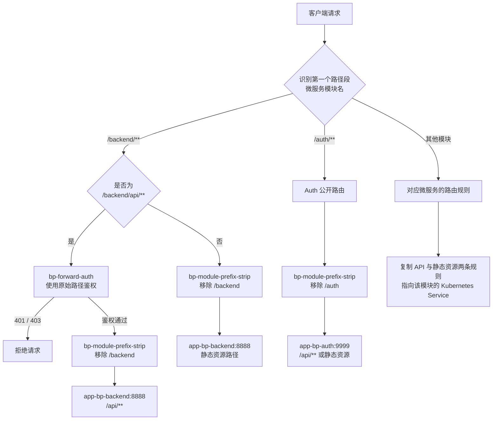
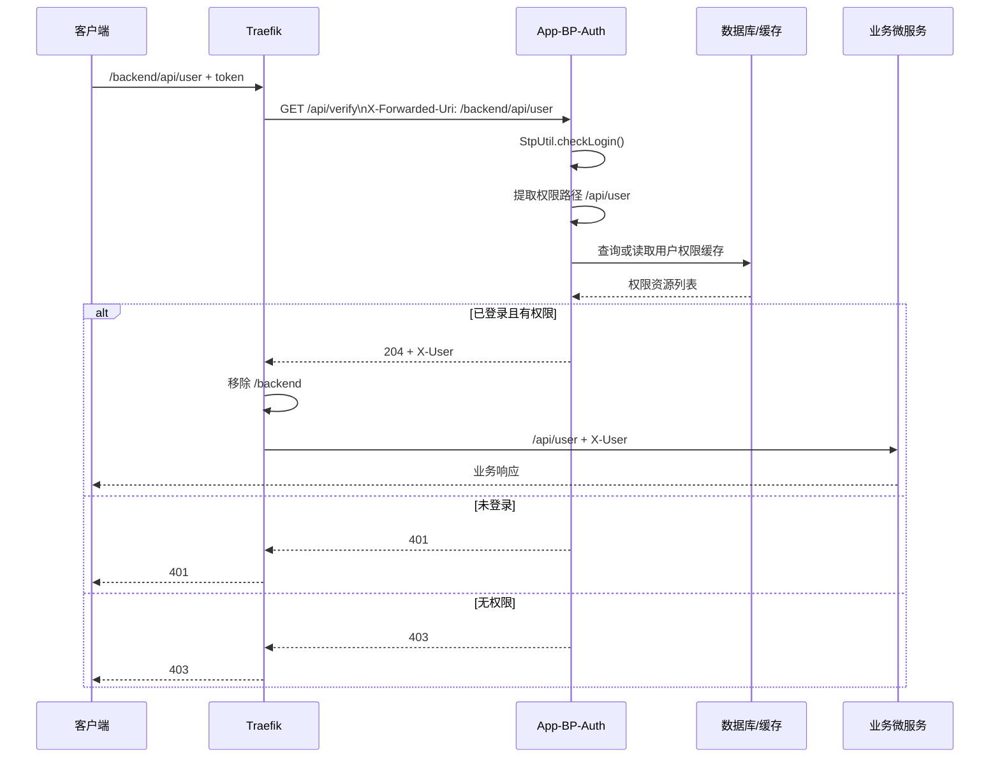

# App-BP-Auth 设计说明

## 1. 模块职责

`App-BP-Auth` 是 Business Process 系统的统一认证与接口鉴权服务，主要负责：

- 使用 Sa-Token 完成登录状态管理；
- 通过 Traefik `ForwardAuth` 校验受保护的 API；
- 从数据库加载用户、角色和接口权限；
- 将已认证用户写入 `X-User` 请求头，传递给下游微服务；
- 区分后端 API 与前端静态资源，静态资源不执行鉴权。

模块监听端口为 `8890`，Controller 的内部统一前缀为 `/api`。

## 2. 外部路由约定

所有外部地址的第一段都是微服务模块名。

| 类型 | 外部地址 | 转发目标 | 内部地址 | 是否鉴权 |
|---|---|---|---|---|
| Backend API | `/backend/api/user` | `app-bp-backend:8888` | `/api/user` | 是 |
| Backend 静态资源 | `/backend/swagger-ui.html` | `app-bp-backend:8888` | `/swagger-ui.html` | 否 |
| Backend OpenAPI | `/backend/v3/api-docs` | `app-bp-backend:8888` | `/v3/api-docs` | 否 |
| Auth 登录 | `/auth/api/login` | `app-bp-auth:9999` | `/api/login` | 否 |
| Auth 注销 | `/auth/api/logout` | `app-bp-auth:9999` | `/api/logout` | 否 |

统一格式如下：

```text
/{moduleName}/api/**  后端 API
/{moduleName}/**      前端静态资源
```

Traefik 使用 `bp-module-prefix-strip` 删除第一段微服务模块名。该中间件采用 `StripPrefixRegex`，还会写入 `X-Forwarded-Prefix`，供 Springdoc 等组件生成正确的外部资源地址。

## 3. 路由规则流程图



Backend 配置两条存在包含关系的路由：

- API 路由优先级为 `100`，匹配 `/backend/api/**`，依次执行鉴权和模块名前缀剥离；
- 静态资源路由优先级为 `10`，匹配 `/backend/**`，只剥离模块名前缀。

显式优先级确保 API 不会落入无需鉴权的静态资源路由。

## 4. API 鉴权流程



关键顺序不能颠倒：`bp-forward-auth` 必须先于 `bp-module-prefix-strip`。这样 Auth 服务收到的 `X-Forwarded-Uri` 仍是带模块名的原始地址，然后由 `AuthService.apiPath()` 提取 `/api` 开始的权限资源。

## 5. 登录与用户传递

### 登录接口

外部请求：

```text
POST /auth/api/login?username=...&password=...
```

内部请求：

```text
POST /api/login
```

登录成功后，Sa-Token 创建 `web` 类型的登录会话。Token 默认可通过以下位置传递：

- `token` Header；
- `token` Cookie；
- `Authorization` Header。

### 下游用户上下文

鉴权成功后，Auth 服务将用户信息序列化到响应头：

```text
X-User: {"id":1,"username":"admin","realName":"管理员"}
```

Traefik 通过 `authResponseHeaders` 把该响应头加入业务请求。下游模块中的 `Lib-Spring-Auth` 会解析 `X-User`，并通过 `AuthenticatedUserContext` 为当前请求提供用户上下文。

## 6. 权限模型

普通用户权限通过以下关系加载：

```text
t_sys_user
  -> t_sys_user_role
  -> t_sys_role
  -> t_sys_role_menu
  -> t_sys_menu_permission
  -> t_sys_permission.resource
```

`t_sys_permission.resource` 保存去掉微服务模块名后的内部 API 路径，例如：

```text
/api/user
/api/user/list
```

权限判断规则：

- 用户 ID 为 `1` 时视为管理员，直接放行；
- 权限资源为 `*` 时放行所有 API；
- 其他情况要求权限资源与请求 API 路径完全相等；
- 用户状态必须为 `1`；
- 角色和权限使用 Caffeine 缓存，写入后有效期为 3 秒。

静态资源不会进入 `ForwardAuth`，因此不需要配置到 `t_sys_permission`。

## 7. 主要代码

| 文件 | 职责 |
|---|---|
| `AuthController.java` | 提供 `/api/login`、`/api/logout` 和内部 `/api/verify` 接口 |
| `AuthService.java` | 用户查询、密码校验、角色加载、权限加载和 URL 权限判断 |
| `SaTokenPermissionProvider.java` | 向 Sa-Token 提供角色和权限列表 |
| `AuthExceptionHandler.java` | 将未登录和无效用户等异常转换为 HTTP 401 |
| `traefik-auth.yaml` | 定义 ForwardAuth、模块前缀剥离和 K3s IngressRoute |

## 8. 新增微服务路由

新增一个模块时，需要在 `traefik-auth.yaml` 中添加两条指向同一 Kubernetes Service 的路由。以模块 `report` 为例：

```yaml
routes:
  - match: Path(`/report/api`) || PathPrefix(`/report/api/`)
    kind: Rule
    priority: 100
    middlewares:
      - name: bp-forward-auth
      - name: bp-module-prefix-strip
    services:
      - name: app-report
        port: 8080

  - match: Path(`/report`) || PathPrefix(`/report/`)
    kind: Rule
    priority: 10
    middlewares:
      - name: bp-module-prefix-strip
    services:
      - name: app-report
        port: 8080
```

新增时必须保证：

1. API 路由优先级高于静态资源路由；
2. API 路由中 `bp-forward-auth` 位于 `bp-module-prefix-strip` 之前；
3. Controller 的接口统一放在 `/api/**` 下；
4. 数据库权限资源保存内部路径 `/api/**`，不包含微服务模块名；
5. Kubernetes Service 端口与 `services.port`、`forwardAuth.address` 使用的集群内端口保持一致。

## 9. 配置与验证

本地配置位于 `src/main/resources/application.yml`，主要包括：

- Auth 服务端口 `8890`；
- MySQL 用户及权限数据源；
- Redis Sa-Token 会话存储；
- Sa-Token 并发、超时及 Token 读取方式。

运行模块测试：

```shell
gradle :App-BP-Auth:test --no-daemon
```

应用 K3s 路由配置：

```shell
kubectl apply -f App-BP-Auth/deploy/k3s/traefik-auth.yaml
```
